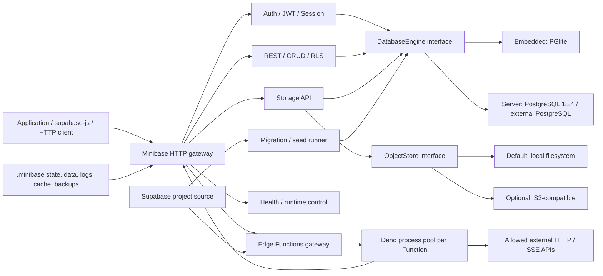

# Minibase

<p align="center">
  
</p>

[English](./README.md) | [简体中文](./README.zh-CN.md)

Minibase is a Supabase-compatible backend for local development, desktop applications, personal
services, and lightweight self-hosting. It reads an existing Supabase project's
`supabase/functions`, `supabase/migrations`, `supabase/seed.sql`, and `supabase/config.toml`, then
provides Database, Auth, REST, Storage, and Edge Functions without requiring the complete Supabase
local microservice stack.

Copy an existing Supabase project into a Minibase project, run the compatibility checks, and start
the HTTP API with one executable. Application code continues to use `@supabase/supabase-js`; Edge
Functions continue to use Deno, `Deno.serve(...)`, or the default export form generated by the
Supabase CLI.

> Minibase targets the common Supabase development experience and project layout. It is not a
> repackaging of every Supabase service. Realtime, Studio, full PostgREST/GoTrue, OAuth/MFA/SAML,
> and arbitrary PostgreSQL extensions are outside the current scope.

## Why Minibase

- **Reuse existing Supabase projects:** migrations, seed data, and Function source files are not
  rewritten.
- **No Supabase local stack:** release binaries do not require Docker, Supabase CLI, Node.js, or a
  separate Deno install.
- **One product, two database editions:** Embedded uses PGlite; Server uses PostgreSQL 18.4.
- **Local-first Storage:** objects are stored in the project directory by default, with an optional
  S3-compatible backend.
- **Low client migration cost:** common Auth, REST, Storage, and Functions paths continue to work
  through `supabase-js`.
- **Local and remote Functions:** clients call `/functions/v1/<name>` while Functions can `fetch`
  external HTTP services.
- **Explicit boundaries:** unsupported SQL, extensions, and Supabase behavior produce diagnostics
  instead of semantic rewrites.

## Architecture

Minibase has one codebase and one implementation of Auth, REST, Storage, Functions, and migrations.
Embedded and Server share every upper layer and only replace the database adapter and bundled
database resources.



Every request enters one `Deno.serve` listener and is dispatched by its Supabase-compatible path:

| Path                              | Capability                                                                       |
| --------------------------------- | -------------------------------------------------------------------------------- |
| `/auth/v1/*`                      | Email/password, anonymous users, sessions, refresh tokens, basic Admin, and JWKS |
| `/rest/v1/*`                      | Common CRUD, filters, pagination, relationships, upsert, exact counts, and RLS   |
| `/storage/v1/*`                   | Buckets, upload, download, delete, list, signed/public URLs, and RLS             |
| `/functions/v1/<name>`            | JWT, CORS, rate limits, remote calls, Deno Functions, and outbound `fetch`       |
| `/functions/v1/docs`              | Browser documentation and Try it console for current Functions                   |
| `/functions/v1/docs/openapi.json` | Generated OpenAPI 3.0.3 specification                                            |
| `/health/live`                    | Process liveness check                                                           |
| `/health/ready`                   | Database, migration, Storage, and Function readiness check                       |

Runtime data stays in `.minibase/`; Minibase does not write runtime state into the `supabase/`
source tree.

```text
your-project/
  minibase.toml               # Optional Minibase configuration
  supabase/
    config.toml               # Supabase project configuration
    migrations/
    seed.sql
    functions/
  .minibase/                  # Generated runtime state; do not commit
    data/
    storage/
    logs/
    cache/
    backups/
    project.json
    runtime.json
    secrets.json
```

## Features

| Module           | Current capability                                                                                                                        |
| ---------------- | ----------------------------------------------------------------------------------------------------------------------------------------- |
| Migration / Seed | Timestamp-ordered migrations, SHA-256 checks, attempt history, and first-run `seed.sql`                                                   |
| Database         | Common PostgreSQL SQL, JSONB, PL/pgSQL triggers, foreign keys, policies, `auth.uid()`, `auth.role()`, and RLS                             |
| Auth             | `signUp`, `signInWithPassword`, `signInAnonymously`, `getUser`, `updateUser`, `signOut`, refresh tokens, and basic Admin                  |
| REST             | insert/select/update/delete/upsert, single/maybeSingle, range/limit/order, filters, relationships, and schema headers                     |
| Storage          | Local and S3-compatible backends; common object APIs, streaming, limits, and consistency repair                                           |
| Edge Functions   | `Deno.serve`, default Fetch handlers, common `@supabase/server` Context, caching, hot reload, logs, JWT, network policy, and OpenAPI docs |
| Operations       | doctor, dual-engine migration checks, health, structured logs, backup/restore, upgrades, repair, and Auth key rotation                    |

See the [Supabase compatibility matrix](./docs/COMPATIBILITY.md) for the complete, traceable support
boundary.

## Embedded or Server

| Dimension         | Embedded                                                                           | Server                                                                                  |
| ----------------- | ---------------------------------------------------------------------------------- | --------------------------------------------------------------------------------------- |
| Database          | Bundled PGlite                                                                     | Bundled PostgreSQL 18.4 or external PostgreSQL                                          |
| Recommended use   | Local development, desktop apps, personal services, NAS, low-to-medium concurrency | Team services, higher concurrency, direct database access, native PostgreSQL operations |
| Write concurrency | Transactions are protected by one PGlite Worker                                    | PostgreSQL connection pool and native backends run in parallel                          |
| PostgreSQL TCP    | Not provided                                                                       | Managed PostgreSQL is local-only by default; external databases are operator-managed    |
| Extensions        | Only capabilities verified in the PGlite distribution                              | Depends on the bundled Runtime or external PostgreSQL installation                      |
| Storage           | Local by default, optional S3-compatible                                           | Local by default, optional S3-compatible                                                |

Choose Embedded by default. Choose Server when you need higher write concurrency, PostgreSQL TCP,
native tooling, logical replication, or a specific extension. Both editions use the same application
APIs and project format.

See [Embedded and Server edition selection](./docs/EDITIONS.md) for the cross-engine migration
workflow.

## Quick Start

### 1. Prepare a Supabase project

Minibase accepts either the project root or its `supabase/` directory. Existing projects need no
conversion:

```text
your-project/
  supabase/
    config.toml
    migrations/
      20260801000000_create_schema.sql
    seed.sql
    functions/
      hello/
        index.ts
```

Migrations, seed data, and Functions are optional, but keep the `supabase/` directory.

### 2. Download a release

- Windows x64: `minibase-embedded-windows-x64.exe` or `minibase-server-windows-x64.exe`
- Linux x64: `minibase-embedded-linux-x64` or `minibase-server-linux-x64`
- macOS x64: `minibase-embedded-macos-x64` or `minibase-server-macos-x64`
- macOS arm64: `minibase-embedded-macos-arm64` or `minibase-server-macos-arm64`

Each release includes its Runtime, third-party notices, and a separate SHA-256 checksum. Neither
edition needs a separate Deno installation. Server can also use external PostgreSQL through
`MINIBASE_DATABASE_URL`.

On Linux and macOS, grant execute permission first:

```sh
chmod 755 ./minibase-embedded-linux-x64
```

### 3. Run the preflight check

```powershell
.\minibase-embedded-windows-x64.exe doctor --project .
```

`doctor` checks project layout, configuration, migrations, Function entrypoints, dependencies,
database capabilities, and known PGlite incompatibilities before writing data. Exit code `0` permits
startup; exit code `2` reports an issue that must be handled.

Check migrations against both database engines with the Server artifact:

```powershell
.\minibase-server-windows-x64.exe migration check --project .
```

### 4. Start Minibase

```powershell
.\minibase-embedded-windows-x64.exe start --project .
```

`start` runs in the foreground. Minibase listens on `127.0.0.1`; the API port comes from
`supabase/config.toml` or defaults to `54321`. First startup creates `.minibase/`, initializes the
database, applies migrations and seed data, and prepares Storage and Function Workers.

In another terminal:

```powershell
.\minibase-embedded-windows-x64.exe status --project . --json
.\minibase-embedded-windows-x64.exe stop --project .
```

### 5. Use `supabase-js`

```ts
import { createClient } from "@supabase/supabase-js";

const supabase = createClient("http://127.0.0.1:54321", "minibase-local", {
  auth: { persistSession: false },
});

const { data: signup, error: signupError } = await supabase.auth.signUp({
  email: "alice@example.com",
  password: "correct horse battery staple",
  options: { data: { display_name: "Alice" } },
});
if (signupError) throw signupError;

const { data: note, error: noteError } = await supabase
  .from("notes")
  .insert({ owner_id: signup.user!.id, body: "hello from Minibase" })
  .select("id,body")
  .single();
if (noteError) throw noteError;

const { data: functionResult, error: functionError } = await supabase.functions.invoke("hello", {
  body: { noteId: note.id },
});
if (functionError) throw functionError;

console.log({ note, functionResult });
```

The local `anonKey` only needs to be a non-empty client identifier. After login, the access token
drives RLS and protected Function calls.

### 6. Run a Supabase Edge Function

Existing Functions continue to use Deno:

```ts
Deno.serve(async (request) => {
  const body = await request.json();
  const upstream = await fetch("https://api.example.com/v1/process", {
    method: "POST",
    headers: { "content-type": "application/json" },
    body: JSON.stringify(body),
  });

  return new Response(upstream.body, {
    status: upstream.status,
    headers: upstream.headers,
  });
});
```

Remote clients use the same path:

```text
POST https://your-minibase.example/functions/v1/hello
```

Minibase supports the default export generated by Supabase CLI 2.110.0 and reads each Function's
`deno.json`, `deno.lock`, and `verify_jwt`, `entrypoint`, and `import_map` settings. Local imports
must remain inside the allowed `supabase/` boundary.

### 7. Browse Function documentation

```text
http://127.0.0.1:54321/functions/v1/docs
http://127.0.0.1:54321/functions/v1/docs/openapi.json
```

The first endpoint is a browser documentation page and Try it console. The second is an OpenAPI
3.0.3 document. Generation does not execute user code or expose secrets, environment variables,
lockfiles, or Function source.

## Configuration

Keep Supabase-compatible settings in `supabase/config.toml` and Minibase settings in
`minibase.toml`. Precedence is CLI arguments, environment variables, Secret file, `minibase.toml`,
`supabase/config.toml`, then defaults.

```toml
format_version = 1

[server]
host = "127.0.0.1"
port = 54321
public_url = "http://127.0.0.1:54321"

[database]
engine = "pglite"

[storage]
driver = "local"

[functions.runtime]
workers_per_function = 2

[functions.network]
outbound = "allow"
allow_supabase_url = true
block_private_networks = false
```

### Remote access and outbound requests

Minibase can listen on non-loopback addresses so browsers, mobile clients, servers, and LAN devices
can call Auth, REST, Storage, and Functions. For public deployment, configure HTTPS, an accurate
`public_url`, CORS, and trusted proxies. A reverse proxy is the recommended TLS termination point.

```toml
format_version = 1

[server]
host = "0.0.0.0"
port = 54321
public_url = "https://api.example.com"

[server.cors]
allowed_origins = ["https://app.example.com"]

[functions.network]
outbound = "allowlist"
allowed_hosts = ["api.openai.com:443", "*.example.com:443"]
allow_supabase_url = true
block_private_networks = true
```

- `allow` permits external `fetch` requests.
- `allowlist` permits only `allowed_hosts`.
- `deny` rejects external network access.
- `block_private_networks = true` blocks private IP targets and DNS rebinding to private networks.
- `allow_supabase_url = true` lets a Function call the current Minibase API under an allowlist.

Regular JSON and OpenAI-compatible SSE responses are supported. See
[production deployment](./docs/DEPLOYMENT.md) and the [security model](./docs/SECURITY.md).

### S3-compatible Storage

Storage uses `.minibase/storage/` by default. To use an object store:

```toml
format_version = 1

[storage]
driver = "s3"

[storage.s3]
endpoint = "https://objects.example.com"
region = "auto"
bucket = "minibase-project"
path_style = true
```

Provide credentials through a protected Secret file or environment variables:

```text
MINIBASE_S3_ACCESS_KEY_ID=...
MINIBASE_S3_SECRET_ACCESS_KEY=...
MINIBASE_S3_SESSION_TOKEN=...
```

The S3-compatible Storage path has controlled tests for SigV4, streaming, CopyObject, failure
recovery, and single-writer ownership. Real AWS S3, Cloudflare R2, and MinIO credentials are
optional provider validations rather than release blockers; validate a non-production bucket before
deployment.

## Common CLI

| Command                                              | Purpose                                                                  |
| ---------------------------------------------------- | ------------------------------------------------------------------------ |
| `start` / `stop` / `status`                          | Start, stop, and inspect runtime state                                   |
| `doctor`                                             | Check the project, database, Storage, and Functions before writing data  |
| `prepare`                                            | Create runtime directories and the engine marker only                    |
| `reset --force`                                      | Back up, then recreate the database and configured Storage               |
| `upgrade`                                            | Back up and upgrade the project data format offline                      |
| `migration check`                                    | Check migrations in isolated Embedded and Server databases               |
| `migration recover --migration-version <id> --force` | Retry a reviewed non-transactional migration                             |
| `backup export` / `backup restore`                   | Export or restore logical backups, optionally including Storage contents |
| `functions cache` / `functions logs`                 | Prepare Function dependencies and inspect persistent logs                |
| `storage check` / `storage repair --force`           | Check or repair object metadata/content consistency                      |
| `storage unlock --force`                             | Release stale S3 ownership after all writers stop                        |
| `auth keys list/rotate/activate/remove`              | Manage ES256 signing keys without printing private keys                  |
| `version --json`                                     | Print stable machine-readable version information                        |

Commands accept `--project <path>`; database commands accept `--engine pglite` or
`--engine postgres`. Destructive operations require a stopped service, validated target, and
explicit `--force` where applicable.

## Migrations and engine migration

Minibase records each migration's version, SHA-256, transaction policy, and state. Transactional
migrations can be retried after rollback. A migration marked `-- minibase:no-transaction` may leave
partial effects and requires review before `migration recover --force`.

PGlite and PostgreSQL physical data directories are not interchangeable. Switch editions through
logical backup:

```powershell
# Stop and export from Embedded
.\minibase-embedded-windows-x64.exe stop --project .
.\minibase-embedded-windows-x64.exe backup export --project . --engine pglite `
  --output .minibase\backups\to-server --include-storage

# Restore into a new Server project directory
.\minibase-server-windows-x64.exe backup restore --project . --engine postgres `
  --input C:\absolute\path\to\to-server
```

Logical backups stream object contents between Local and S3-compatible Storage. Overwriting an
existing target requires `--force` and creates a safety backup first.

## Security and production

Minibase listens only on `127.0.0.1` by default. For non-loopback or public listeners:

- use HTTPS or a trusted reverse proxy;
- configure an exact `public_url`, CORS origins, and trusted proxy range;
- keep database URLs, S3 credentials, and secrets in protected files or environment variables;
- set `inject_service_role_key = false` for public Functions that do not need administrative access;
- restrict Function egress with `allowlist` and `block_private_networks = true`;
- use `/health/live` for liveness and `/health/ready` for traffic readiness;
- run offline backups and rehearse restore, upgrade, and rollback;
- do not treat the trusted Function pool as an OS sandbox for untrusted multi-tenant code.

See [production deployment](./docs/DEPLOYMENT.md),
[request protection](./docs/REQUEST_PROTECTION.md), [Auth security](./docs/AUTH_SECURITY.md), and
[troubleshooting](./docs/TROUBLESHOOTING.md).

## Compatibility boundaries

The verified targets are the Supabase CLI 2.110.0 project layout, supabase-js 2.110.9, and the
common Context subset of `@supabase/server` 1.4.1. The following are not guaranteed:

- Realtime, Studio, GraphQL, and database change subscriptions;
- complete PostgREST syntax, every operator, and RPC;
- OAuth, Magic Link/OTP email, MFA, SAML, and full GoTrue configuration;
- image transformations, Analytics Bucket, and Vector Bucket;
- Embedded/PGlite PostgreSQL TCP, logical replication, PostGIS, `pgcrypto`, `uuid-ossp`, or
  arbitrary extensions;
- automatic conversion of a PGlite physical directory to PostgreSQL;
- custom named Publishable/Secret Keys;
- strong multi-tenant isolation or strict per-request process isolation for untrusted code.

Run `doctor` and `migration check`, then test your own fixtures against both engines for behavior
outside this list.

## Development

Release users do not need Deno. Contributors use the pinned Deno 2.9.2:

```powershell
deno run -A src/main.ts --help
deno run -A src/main.ts doctor --project fixtures\supabase-basic
deno task fmt:check
deno task lint
deno task check
deno task test
deno task verify:baseline
```

Node.js is not a development or runtime dependency. Rust is not currently required and will only be
introduced when measured performance work justifies a native module.

## Documentation

- [Getting started](./docs/GETTING_STARTED.md)
- [Embedded and Server editions](./docs/EDITIONS.md)
- [Supabase compatibility matrix](./docs/COMPATIBILITY.md)
- [Production deployment](./docs/DEPLOYMENT.md)
- [Security model](./docs/SECURITY.md)
- [Upgrading and rollback](./docs/UPGRADING.md)
- [CLI output contract](./docs/CLI_OUTPUT.md)
- [Health checks](./docs/HEALTH.md)
- [Logging](./docs/LOGGING.md)
- [Doctor diagnostics](./docs/DOCTOR.md)
- [Troubleshooting](./docs/TROUBLESHOOTING.md)
- [Version policy](./docs/VERSIONS.md)
- [Third-party license index](./docs/THIRD_PARTY_LICENSES.md)

## License

Minibase is licensed under the [Apache License 2.0](./LICENSE). Release packages also retain the
applicable licenses and notices for Deno, PGlite, PostgreSQL, OpenSSL, ICU, and other third-party
components.
