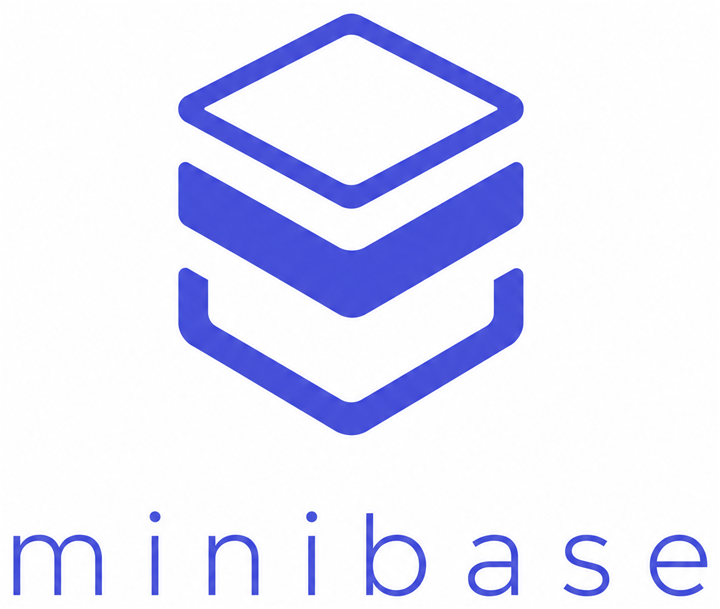
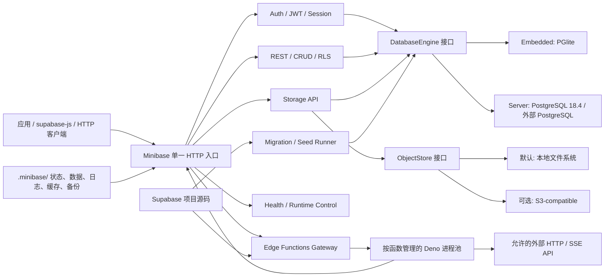

# Minibase

<p align="center">
  
</p>

[English](./README.md) | [简体中文](./README.zh-CN.md)

Minibase 是一个面向本地开发、桌面应用、个人服务和轻量自托管场景的 Supabase-compatible
后端。它直接读取现有 Supabase 项目的 `supabase/functions`、
`supabase/migrations`、`supabase/seed.sql` 和 `supabase/config.toml`，提供数据库、Auth、REST、
Storage 与 Edge Functions，不要求在本地启动整套 Supabase 微服务。

你可以把一个已有 Supabase 项目的源码复制到 Minibase 项目中，先运行兼容性检查，再用一个可执行文件启动
HTTP API。应用侧继续使用 `@supabase/supabase-js`，Edge Function 也继续使用 Deno、`Deno.serve(...)`
或 Supabase CLI 生成的默认导出形式。

> Minibase 追求的是常用 Supabase 开发体验和项目布局的兼容，不是 Supabase 全部服务的重新打包。
> Realtime、Studio、完整 PostgREST/GoTrue、OAuth/MFA/SAML 和任意 PostgreSQL Extension
> 不在当前范围内。

## 为什么是 Minibase

- **直接复用 Supabase 项目**：不改写原始 migration、seed 或 Function 源码。
- **不依赖 Supabase 本地栈**：运行发行版不需要 Docker、Supabase CLI、Node.js 或单独安装 Deno。
- **一个产品，两种数据库形态**：Embedded 使用内置 PGlite；Server 使用 PostgreSQL 18.4。
- **默认本地优先**：Storage 默认写入项目本地目录，需要时可切换到 S3-compatible 后端。
- **客户端迁移成本低**：常用 Auth、REST、Storage 和 Functions 路径可继续通过 `supabase-js` 调用。
- **本地与远程都能调用 Function**：远程客户端可访问 `/functions/v1/<name>`；Function 内部可使用
  `fetch` 调用 OpenAI-compatible API 等外部 HTTP 服务。
- **显式兼容边界**：不支持的 SQL、Extension 或 Supabase 行为会由 `doctor`、`migration check`
  或运行时明确报错，不静默改变语义。

## 架构

Minibase 只有一个代码库和一套 Auth、REST、Storage、Functions 与 Migration 实现。Embedded 和 Server
共享全部上层逻辑，只替换数据库适配器与发行包中携带的数据库资源。



一次请求只进入一个 `Deno.serve` HTTP listener，然后根据 Supabase-compatible 路径分发：

| 路径                              | 能力                                                           |
| --------------------------------- | -------------------------------------------------------------- |
| `/auth/v1/*`                      | 邮箱密码、匿名用户、Session、Refresh Token、基础 Admin 与 JWKS |
| `/rest/v1/*`                      | 常用 CRUD、过滤、分页、关系选择、upsert、精确 count 与 RLS     |
| `/storage/v1/*`                   | Bucket、上传、下载、删除、列表、Signed URL、Public URL 与 RLS  |
| `/functions/v1/<name>`            | JWT、CORS、速率限制、远程调用、Deno Function 与出站 `fetch`    |
| `/functions/v1/docs`              | 当前 Edge Functions 的浏览器文档页与 Try it 控制台             |
| `/functions/v1/docs/openapi.json` | 自动生成的 OpenAPI 3.0.3 规格                                  |
| `/health/live`                    | 进程存活检查                                                   |
| `/health/ready`                   | 数据库、migration、Storage 与 Functions 就绪检查               |

运行数据集中保存在项目的 `.minibase/` 中；Minibase 不向 `supabase/` 源码目录写入运行状态。

```text
your-project/
  minibase.toml               # 可选：Minibase 专属配置
  supabase/
    config.toml               # Supabase 项目配置
    migrations/
    seed.sql
    functions/
  .minibase/                  # Minibase 运行时生成，不应提交到源码仓库
    data/
    storage/
    logs/
    cache/
    backups/
    project.json
    runtime.json
    secrets.json
```

## 功能概览

| 模块             | 当前能力                                                                                                                             |
| ---------------- | ------------------------------------------------------------------------------------------------------------------------------------ |
| Migration / Seed | 按 14 位时间戳顺序执行 migration，校验 SHA-256，记录尝试状态；migration 完成后首次执行 `seed.sql`                                    |
| 数据库           | 常见 PostgreSQL SQL、JSONB、PL/pgSQL Trigger、外键、Policy、`auth.uid()`、`auth.role()` 与 RLS                                       |
| Auth             | `signUp`、`signInWithPassword`、`signInAnonymously`、`getUser`、`updateUser`、`signOut`、Refresh Token 与基础 Admin                  |
| REST             | insert/select/update/delete/upsert、single/maybeSingle、range/limit/order、常用过滤、关系选择与 Schema Header                        |
| Storage          | Local 与 S3-compatible 后端；upload/download/remove/list、Signed URL、Public URL、流式传输、MIME/大小限制与一致性修复                |
| Edge Functions   | `Deno.serve`、默认导出 Fetch Handler、`@supabase/server` 常用 Context、依赖缓存、热重载、日志、入站 JWT、出站网络策略与 OpenAPI 文档 |
| 运维             | doctor、双引擎 migration check、健康检查、结构化日志、逻辑备份/恢复、离线升级、Storage 检查/修复与 Auth Key 轮换                     |

完整、可追溯的支持范围见 [Supabase 兼容性矩阵](./docs/COMPATIBILITY.md)。

## 选择 Embedded 还是 Server

| 维度           | Embedded                                    | Server                                             |
| -------------- | ------------------------------------------- | -------------------------------------------------- |
| 数据库         | 内置 PGlite                                 | 内置托管 PostgreSQL 18.4，或外部 PostgreSQL        |
| 推荐场景       | 本地开发、桌面应用、个人服务、NAS、中低并发 | 团队服务、高并发、数据库直连与原生 PostgreSQL 运维 |
| 写入并发       | PGlite Worker 串行保护数据库事务            | PostgreSQL 连接池并行访问                          |
| PostgreSQL TCP | 不提供                                      | 托管数据库默认仅本机访问；外部数据库由管理员管理   |
| Extension      | 仅限发行版已验证的 PGlite 能力              | 取决于随附 Runtime 或外部 PostgreSQL 的实际安装    |
| Storage        | 默认 Local，可选 S3-compatible              | 默认 Local，可选 S3-compatible                     |

默认优先选择 Embedded。只有需要更高并发、PostgreSQL TCP、原生运维工具、逻辑复制或特定 Extension
时，再选择 Server。两个发行版不是两条产品分支，应用 API 与项目格式保持一致。

更详细的选择和跨引擎迁移流程见 [Embedded 与 Server 发行版选择](./docs/EDITIONS.md)。

## 五分钟开始使用

### 1. 准备一个 Supabase 项目

Minibase 可以从项目根目录或 `supabase/` 目录开始查找项目。推荐保留标准布局：

```text
your-project/
  supabase/
    config.toml
    migrations/
      20260801000000_create_schema.sql
    seed.sql
    functions/
      hello/
        index.ts
```

Migration、seed 和 Functions 都是可选能力，但项目应保留 `supabase/` 目录；已有 Supabase 项目可以直接
使用，无需执行转换命令。

### 2. 获取可执行文件

从项目 Release 中选择与你的平台和数据库形态一致的发行包：

- Windows x64：`minibase-embedded-windows-x64.exe` 或 `minibase-server-windows-x64.exe`
- Linux x64：`minibase-embedded-linux-x64` 或 `minibase-server-linux-x64`
- macOS x64：`minibase-embedded-macos-x64` 或 `minibase-server-macos-x64`
- macOS arm64：`minibase-embedded-macos-arm64` 或 `minibase-server-macos-arm64`

每个发行包包含运行所需的 Runtime、兼容说明和第三方许可证，Release 同时提供独立的 SHA-256
校验和。Embedded/Server 的正式包均不要求用户另外安装 Deno；Server 默认使用发行包携带的 PostgreSQL
Runtime，也可通过 `MINIBASE_DATABASE_URL` 连接外部 PostgreSQL。

Linux 和 macOS 首次运行前需要赋予执行权限：

```sh
chmod 755 ./minibase-embedded-linux-x64
```

以下 Windows 示例使用 Embedded；其他平台只需替换可执行文件名。

### 3. 启动前检查

```powershell
.\minibase-embedded-windows-x64.exe doctor --project .
```

`doctor` 会在写入数据库前检查项目布局、配置、migration、Function 入口、依赖缓存、数据库能力和已知
PGlite 不兼容项。退出码 `0` 表示可以继续，退出码 `2` 表示存在必须处理的兼容或安全问题。

需要同时验证 Embedded/PGlite 与 Server/PostgreSQL migration 时运行：

```powershell
.\minibase-server-windows-x64.exe migration check --project .
```

### 4. 启动 Minibase

```powershell
.\minibase-embedded-windows-x64.exe start --project .
```

`start` 是前台进程。默认监听 `127.0.0.1`，端口优先读取 `supabase/config.toml` 的 `api.port`，缺省为
`54321`。首次启动会创建 `.minibase/`、初始化数据库、应用 migration、执行 seed、准备 Storage 与
Function Worker，并写入运行状态和日志。

在另一个终端查看状态或停止：

```powershell
.\minibase-embedded-windows-x64.exe status --project . --json
.\minibase-embedded-windows-x64.exe stop --project .
```

### 5. 使用 supabase-js

应用代码继续使用普通 Supabase 客户端。当前本地模式下，`anonKey` 只需是非空客户端标识；用户登录后，
Access Token 会自动用于 RLS 和受保护的 Function。

```ts
import { createClient } from "@supabase/supabase-js";

const supabase = createClient("http://127.0.0.1:54321", "minibase-local", {
  auth: { persistSession: false },
});

const { data: signup, error: signupError } = await supabase.auth.signUp({
  email: "alice@example.com",
  password: "correct horse battery staple",
  options: { data: { display_name: "Alice" } },
});
if (signupError) throw signupError;

const { data: note, error: noteError } = await supabase
  .from("notes")
  .insert({ owner_id: signup.user!.id, body: "hello from Minibase" })
  .select("id,body")
  .single();
if (noteError) throw noteError;

const { data: functionResult, error: functionError } = await supabase.functions.invoke("hello", {
  body: { noteId: note.id },
});
if (functionError) throw functionError;

console.log({ note, functionResult });
```

### 6. 运行 Supabase Edge Function

原有 Function 可以继续使用 Deno：

```ts
Deno.serve(async (request) => {
  const body = await request.json();
  const upstream = await fetch("https://api.example.com/v1/process", {
    method: "POST",
    headers: { "content-type": "application/json" },
    body: JSON.stringify(body),
  });

  return new Response(upstream.body, {
    status: upstream.status,
    headers: upstream.headers,
  });
});
```

远程客户端可通过以下地址调用：

```text
POST https://your-minibase.example/functions/v1/hello
```

Minibase 也支持 Supabase CLI 2.110.0 `functions new` 生成的默认导出形式，并读取函数目录中的
`deno.json`、`deno.lock`，以及 `supabase/config.toml` 中的 `verify_jwt`、`entrypoint` 和
`import_map`。自定义入口和本地依赖必须位于允许的 `supabase/` 安全边界内。

### 7. 查看 Function 文档

启动 Minibase 后，直接打开以下地址即可查看当前项目的函数列表、JWT 要求和本地 Try it 控制台：

```text
http://127.0.0.1:54321/functions/v1/docs
```

机器或工具可以读取同源的 OpenAPI 3.0.3 JSON：

```text
http://127.0.0.1:54321/functions/v1/docs/openapi.json
```

规格由 `supabase/functions` 目录和 `supabase/config.toml` 实时生成，不执行用户函数，也不会输出
Secret、环境变量、lockfile 内容或源码正文。Minibase 会根据常见 `request.method`/`case` 分支做有限的
HTTP 方法启发式识别；请求和响应 schema
默认是通用描述，复杂业务参数仍应以函数自身校验和项目契约为准。

## 配置

Supabase 兼容配置继续放在 `supabase/config.toml`；Minibase 专属配置放在项目根目录的
`minibase.toml`。主要配置优先级为：CLI 参数、环境变量、Secret 文件、`minibase.toml`、
`supabase/config.toml`、默认值。

一个本地 Embedded 配置可以非常简单：

```toml
format_version = 1

[server]
host = "127.0.0.1"
port = 54321
public_url = "http://127.0.0.1:54321"

[database]
engine = "pglite"

[storage]
driver = "local"

[functions.runtime]
workers_per_function = 2

[functions.network]
outbound = "allow"
allow_supabase_url = true
block_private_networks = false
```

### 远程访问与 Function 出站请求

Minibase 可以监听非回环地址，因此浏览器、移动端、其他服务器或局域网设备可以请求 Auth、REST、Storage
和 Functions。对外部署时至少配置 HTTPS、正确的 `public_url`、CORS 和可信代理；推荐由反向代理负责
公网 TLS。

```toml
format_version = 1

[server]
host = "0.0.0.0"
port = 54321
public_url = "https://api.example.com"

[server.cors]
allowed_origins = ["https://app.example.com"]

[functions.network]
outbound = "allowlist"
allowed_hosts = ["api.openai.com:443", "*.example.com:443"]
allow_supabase_url = true
block_private_networks = true
```

出站策略支持：

- `allow`：允许普通外部 `fetch`；
- `allowlist`：仅允许 `allowed_hosts`；
- `deny`：拒绝外部网络；
- `block_private_networks = true`：阻止字面 IP 和 DNS 解析结果指向私网，降低 SSRF 风险；
- `allow_supabase_url = true`：即使使用 allowlist，也允许 Function 回调当前 Minibase API。

普通 JSON API 与 OpenAI-compatible SSE 流式响应都受支持。更完整的公网部署要求见
[生产部署指南](./docs/DEPLOYMENT.md)和[安全模型](./docs/SECURITY.md)。

### S3-compatible Storage

Storage 默认使用 `.minibase/storage/`。需要对象存储时配置协议兼容后端：

```toml
format_version = 1

[storage]
driver = "s3"

[storage.s3]
endpoint = "https://objects.example.com"
region = "auto"
bucket = "minibase-project"
path_style = true
```

凭据建议通过 Secret 文件或环境变量提供，不要提交到仓库：

```text
MINIBASE_S3_ACCESS_KEY_ID=...
MINIBASE_S3_SECRET_ACCESS_KEY=...
MINIBASE_S3_SESSION_TOKEN=...
```

S3-compatible 实现已经通过受控 SigV4、流式传输、CopyObject、故障恢复和单 writer ownership 测试； AWS
S3、Cloudflare R2、MinIO 等真实厂商环境尚不作为当前发布阻塞条件，上线前应使用独立的非生产 Bucket
自行验证。

## 常用 CLI

```text
minibase <command> [options]
```

| 命令                                                 | 用途                                                              |
| ---------------------------------------------------- | ----------------------------------------------------------------- |
| `start` / `stop` / `status`                          | 启动、停止和查看运行状态                                          |
| `doctor`                                             | 在写入数据前检查项目、配置、数据库、Storage 和 Functions          |
| `prepare`                                            | 只创建运行目录与引擎标记                                          |
| `reset --force`                                      | 先安全备份，再重建数据库与当前配置的 Storage                      |
| `upgrade`                                            | 离线备份并升级项目数据格式                                        |
| `migration check`                                    | 在隔离的 Embedded 与 Server 数据库中检查 migration                |
| `migration recover --migration-version <id> --force` | 人工确认后重试中断的非事务 migration                              |
| `backup export` / `backup restore`                   | 导出或恢复版本化逻辑备份，可通过 `--include-storage` 携带对象正文 |
| `functions cache`                                    | 下载并验证所有 Function 依赖                                      |
| `functions logs`                                     | 读取持久化 Function 日志，可用 `--function` 和 `--tail` 过滤      |
| `storage check` / `storage repair --force`           | 离线检查或修复对象元数据与正文不一致                              |
| `storage unlock --force`                             | 所有 writer 停止后释放崩溃遗留的 S3 ownership                     |
| `auth keys list/rotate/activate/remove`              | 管理 ES256 Auth 签名密钥，不输出私钥                              |
| `version --json`                                     | 输出稳定、机器可解析的版本信息                                    |

所有命令都支持 `--project <path>`；数据库相关命令可使用 `--engine pglite` 或
`--engine postgres`。自动化脚本建议统一使用
`--json`。具有破坏性的命令不会静默执行，必须满足停止服务、 目标路径验证和 `--force` 等前置条件。

## Migration、备份与引擎迁移

Minibase 会记录每个 migration 的版本、SHA-256、事务策略和 `running` / `failed` / `applied`
状态。默认事务型 migration 中断后可依靠数据库回滚安全重试；显式标注 `-- minibase:no-transaction` 的
migration 可能产生部分副作用，因此需要人工核对后执行 `migration recover --force`。

Embedded 的 PGlite 数据目录不能直接转换成 PostgreSQL 数据目录。切换引擎应使用逻辑备份：

```powershell
# 在 Embedded 项目中停止并导出
.\minibase-embedded-windows-x64.exe stop --project .
.\minibase-embedded-windows-x64.exe backup export --project . --engine pglite `
  --output .minibase\backups\to-server --include-storage

# 在一个新的 Server 项目目录中恢复
.\minibase-server-windows-x64.exe backup restore --project . --engine postgres `
  --input C:\absolute\path\to\to-server
```

逻辑备份可以在 Local 与 S3-compatible Storage 之间流式迁移对象正文。覆盖已有目标必须显式使用
`--force`，Minibase 会先创建安全备份；远程对象的覆盖和自动升级仍遵循更严格的快照与 ownership 边界。

## 安全与生产部署

Minibase 默认只监听 `127.0.0.1`，适合本地可信 Supabase 项目。若监听 `0.0.0.0`
或公网地址，请至少完成：

- 使用 HTTPS 或受信任反向代理，不直接暴露明文公网服务；
- 设置精确的 `public_url`、CORS Origin 与可信代理范围；
- 将数据库连接串、S3 凭据和外部 Secret 放入受保护的 Secret 文件或环境变量；
- 对公开 Function 设置 `inject_service_role_key = false`，除非它确实需要管理权限；
- 使用 `allowlist` 和 `block_private_networks = true` 限制 Function 出站网络；
- 将 `/health/live` 用作存活检查，将 `/health/ready` 用作流量就绪检查；
- 定期执行离线逻辑备份，并演练恢复、升级与回滚；
- 使用 `functions logs`、运行时结构化日志和 request id 排查问题；
- 不把本地可信 Function 进程池当作不可信多租户的操作系统级沙箱。

完整上线清单见 [生产部署指南](./docs/DEPLOYMENT.md)、[请求入口保护](./docs/REQUEST_PROTECTION.md)、
[Auth 安全策略](./docs/AUTH_SECURITY.md)和[故障排查](./docs/TROUBLESHOOTING.md)。

## 当前兼容边界

Minibase 已验证的兼容目标包括 Supabase CLI 2.110.0 项目布局、supabase-js 2.110.9，以及
`@supabase/server` 1.4.1 的常用 Function Context 子集。

当前明确不承诺：

- Realtime、Studio、GraphQL 和数据库变更订阅；
- 完整 PostgREST 语法、所有 Operator 与 RPC；
- OAuth、Magic Link/OTP 邮件、MFA、SAML 和完整 GoTrue 配置；
- 图片转换、Analytics Bucket、Vector Bucket；
- Embedded/PGlite 的 PostgreSQL TCP、逻辑复制、PostGIS、`pgcrypto`、`uuid-ossp` 或任意动态
  Extension；
- 自动把 PGlite 物理数据目录转换为 PostgreSQL；
- 自定义命名 Publishable/Secret Key；
- 未经验证代码的强多租户隔离或严格的单请求进程隔离。

若项目依赖未列出的 Supabase/PostgreSQL 行为，请先运行 `doctor` 与 `migration check`，再用你的真实
fixture 分别验证 Embedded 和 Server。

## 从源码开发

普通发行版用户不需要安装 Deno。参与 Minibase 开发时使用仓库固定的 Deno 2.9.2：

```powershell
deno run -A src/main.ts --help
deno run -A src/main.ts doctor --project fixtures\supabase-basic
deno task fmt:check
deno task lint
deno task check
deno task test
deno task verify:baseline
```

Node.js 不是 Minibase 的开发或运行依赖。Rust
目前也不是必需组件；只有真实性能分析证明需要原生优化时， 才会引入对应模块。

## 文档索引

- [五分钟启动指南](./docs/GETTING_STARTED.md)
- [Embedded 与 Server 发行版选择](./docs/EDITIONS.md)
- [Supabase 兼容性矩阵](./docs/COMPATIBILITY.md)
- [生产部署指南](./docs/DEPLOYMENT.md)
- [安全模型与威胁边界](./docs/SECURITY.md)
- [升级与回滚](./docs/UPGRADING.md)
- [CLI 输出契约](./docs/CLI_OUTPUT.md)
- [健康检查](./docs/HEALTH.md)
- [日志](./docs/LOGGING.md)
- [Doctor 诊断](./docs/DOCTOR.md)
- [故障排查](./docs/TROUBLESHOOTING.md)
- [版本策略](./docs/VERSIONS.md)
- [第三方许可证索引](./docs/THIRD_PARTY_LICENSES.md)

## 许可证

Minibase 使用 [Apache License 2.0](./LICENSE) 开源。发行包还会完整保留 Deno、PGlite、PostgreSQL、
OpenSSL、ICU 等第三方组件各自适用的许可证与通知。
